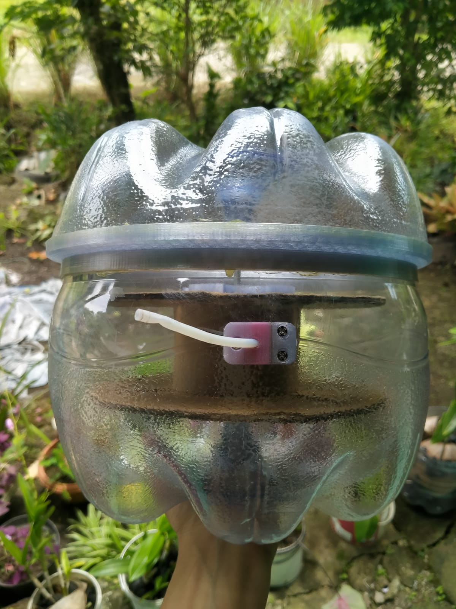
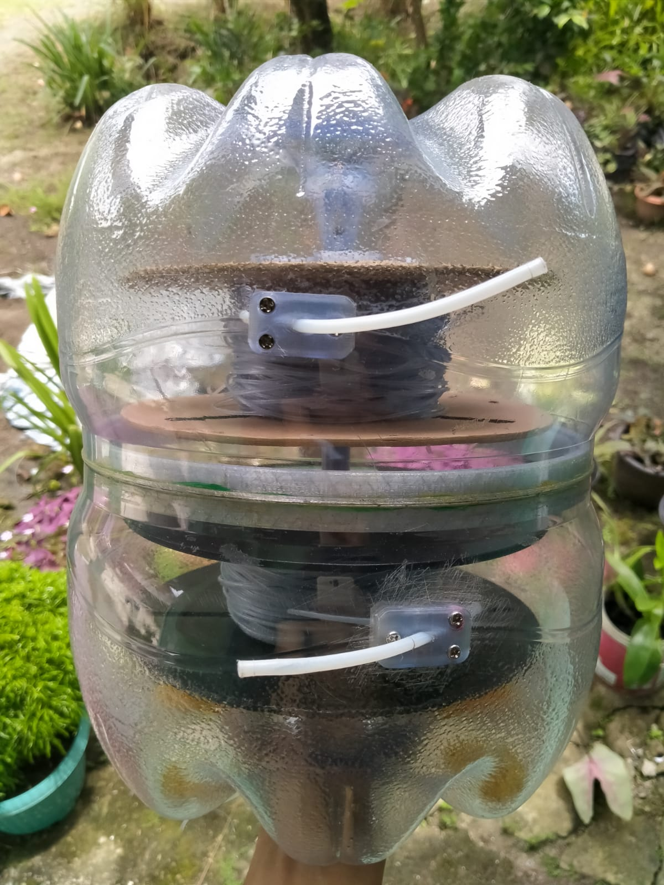
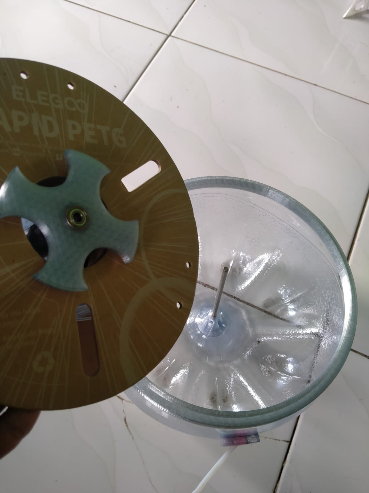
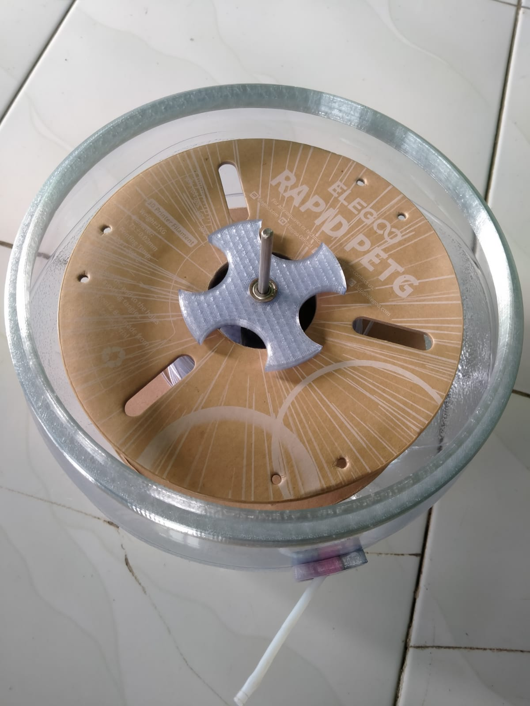

This filament storage is designed to keep 3D printer filament dry and protected from moisture.
The project is modified from a 15L Minerale water gallon, repurposed into a practical, low-cost, and easy-to-build filament storage solution.

The design allows the filament to be used directly from inside the storage, with optional additions such as silica gel or a hygrometer for humidity monitoring.

For design schematics and technical details, please refer to the PDF folder in this repository.

---

  
  

  
  

## Appreciation

You can show your appreciation for this project through the following link:

&nbsp;

 
Thank you for your appreciation!

## Connect with Us

    
  

## Contact Me

